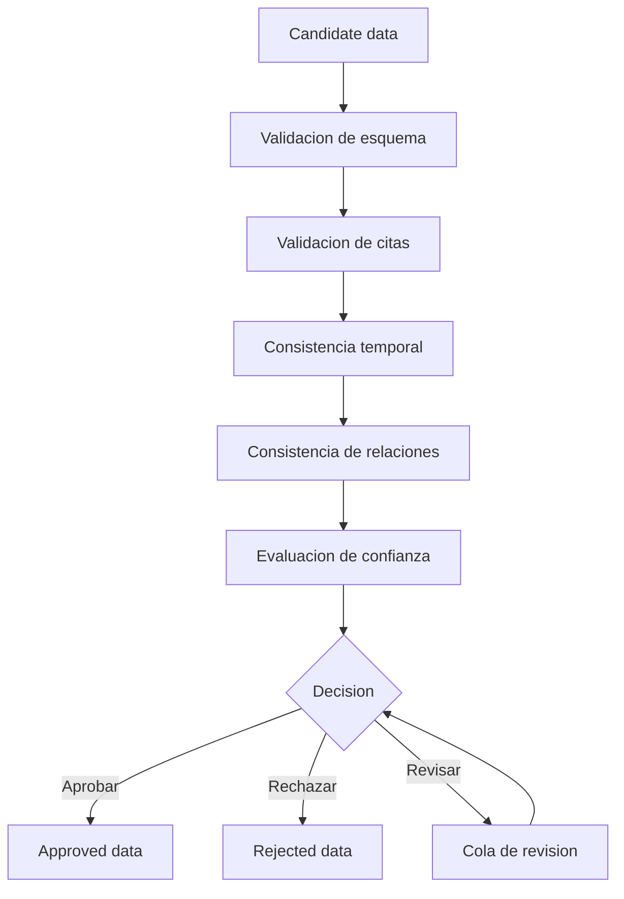

# Pipeline de validacion

## Flujo principal



## Validaciones minimas

### Esquema

- Todos los ids requeridos existen.
- Los enums pertenecen a `legal-contracts`.
- Fechas en formato ISO.
- Relaciones apuntan a entidades existentes.

### Citas

- Toda regla interpretada tiene al menos una cita.
- Toda relacion normativa tiene fuente.
- Toda explicacion simple puede volver a una fuente verificable.

### Tiempo

- `effectiveTo` no puede ser anterior a `effectiveFrom`.
- Cambios historicos deben tener fecha de publicacion o entrada en vigencia cuando la fuente lo permita.
- Snapshots deben indicar fecha.

### Confianza

- Datos generados automaticamente empiezan como `AUTO_EXTRACTED`.
- Datos con baja confianza pasan a `NEEDS_REVIEW`.
- Datos sin cita no pueden aprobarse como interpretacion.

## Salidas

- `APPROVED`: dato validado para consumo.
- `REJECTED`: dato descartado con razon.
- `NEEDS_REVIEW`: dato pendiente de revision humana.

## CLI inicial

El repositorio incluye una CLI minima para validar un candidate bundle y generar un approved bundle de prueba:

```bash
npm run validate:example
```

El comando lee:

```text
examples/candidate-bundle.example.json
```

y escribe:

```text
data/approved/approved-bundle.example.generated.json
```

Esta CLI no reemplaza la revision humana. Es el primer esqueleto funcional para validar estructura, referencias y citas minimas.

Tambien genera un reporte estructural:

```text
data/reports/validation-report.example.generated.json
```

El reporte marca:

- Cobertura de citas por disposicion.
- Citas cuyo texto no coincide exactamente con la disposicion.
- Etiquetas de disposiciones duplicadas.
- Items o disposiciones con estado `DESCONOCIDO`.
- Si el bundle requiere revision humana antes de tratarse como aprobado legalmente.

El approved bundle generado por esta CLI debe entenderse como salida tecnica para probar integracion downstream. La aprobacion legal real requiere decision auditada.

## Flujo 1: dataset estructural de desarrollo

Para construir un dataset descartable desde los candidates generados por `legal-datacollection`:

```bash
npm run build:dev-dataset
```

Salida:

```text
data/dev/dev-structural-approved-bundle.generated.json
```

Este bundle incluye:

- `dataset.mode = DEV_STRUCTURAL`
- `dataset.disposable = true`
- read models para backend/frontend
- resumen de reportes de validacion

No debe usarse como aprobacion legal real.

Para exportar los read models de ese bundle a SQL compatible con D1:

```bash
npm run export:d1:dev
```

Salida:

```text
data/d1/dev-structural-read-models.generated.sql
```

## Flujo 2: revision y aprobacion real

El flujo de aprobacion real debe usar:

- candidate bundle
- reporte de parsing
- reporte de validacion
- checklist de revision humana
- decision auditada

Hasta que exista esa decision, el dato puede visualizarse como desarrollo o pendiente, pero no como dato legal aprobado.
