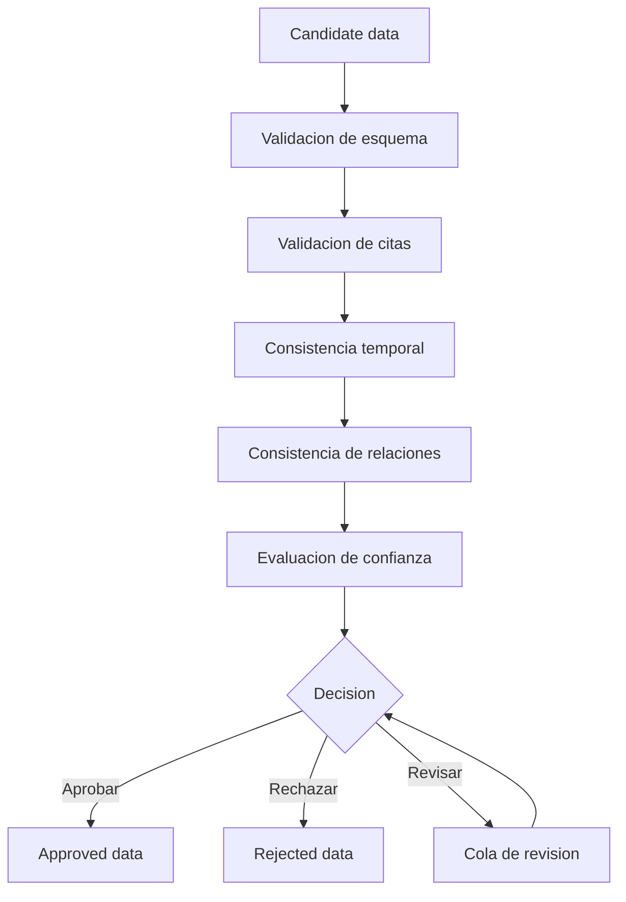

# Pipeline de validacion

## Flujo principal



## Validaciones minimas

### Esquema

- Todos los ids requeridos existen.
- Los enums pertenecen a `legal-contracts`.
- Fechas en formato ISO.
- Relaciones apuntan a entidades existentes.

### Citas

- Toda regla interpretada tiene al menos una cita.
- Toda relacion normativa tiene fuente.
- Toda explicacion simple puede volver a una fuente verificable.

### Tiempo

- `effectiveTo` no puede ser anterior a `effectiveFrom`.
- Cambios historicos deben tener fecha de publicacion o entrada en vigencia cuando la fuente lo permita.
- Snapshots deben indicar fecha.

### Confianza

- Datos generados automaticamente empiezan como `AUTO_EXTRACTED`.
- Datos con baja confianza pasan a `NEEDS_REVIEW`.
- Datos sin cita no pueden aprobarse como interpretacion.

## Salidas

- `APPROVED`: dato validado para consumo.
- `REJECTED`: dato descartado con razon.
- `NEEDS_REVIEW`: dato pendiente de revision humana.

## CLI inicial

El repositorio incluye una CLI minima para validar un candidate bundle y generar un approved bundle de prueba:

```bash
npm run validate:example
```

El comando lee:

```text
examples/candidate-bundle.example.json
```

y escribe:

```text
data/approved/approved-bundle.example.generated.json
```

Esta CLI no reemplaza la revision humana. Es el primer esqueleto funcional para validar estructura, referencias y citas minimas.

